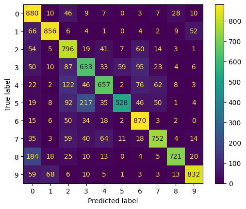

# TransferLearning
This repo shows the effects of using transfer learning for image classification with CNNs. For this project, a ResNet18 model is considered for image classification of the CIFAR10 dataset. Three different versions of the ResNet18 are trained for the task: (1) A pretrained ResNet model on ImageNet with the last fully connected layer replaced with 10 output nodes for the 10 classes, and only this layer is tuned (2) A pretrained ResNet model on ImageNet with the last fully connected layer replaced, and all layers fine tuned (3) A ResNet model not pretrained with the last fully connected layer replaced as well for a baseline.

---

## Model 1 (Pretrained, only FC tuned)
The first model considered is pretrained using ImageNet and is tuned with all layers frozen except for the last FC layer that is replaced to align with the correct number of classes. Results show that the model performs relatively well.

---

## Model 2 (Pretrained, all layers fine tuned)

---

## Model 3 (Not Pretrained)

